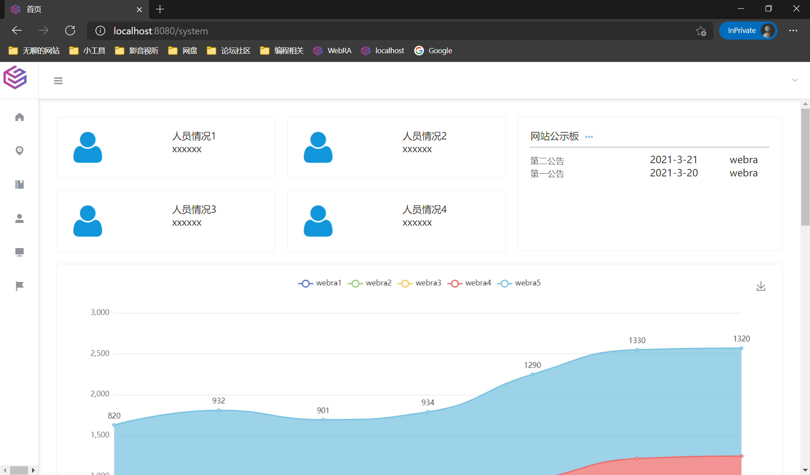
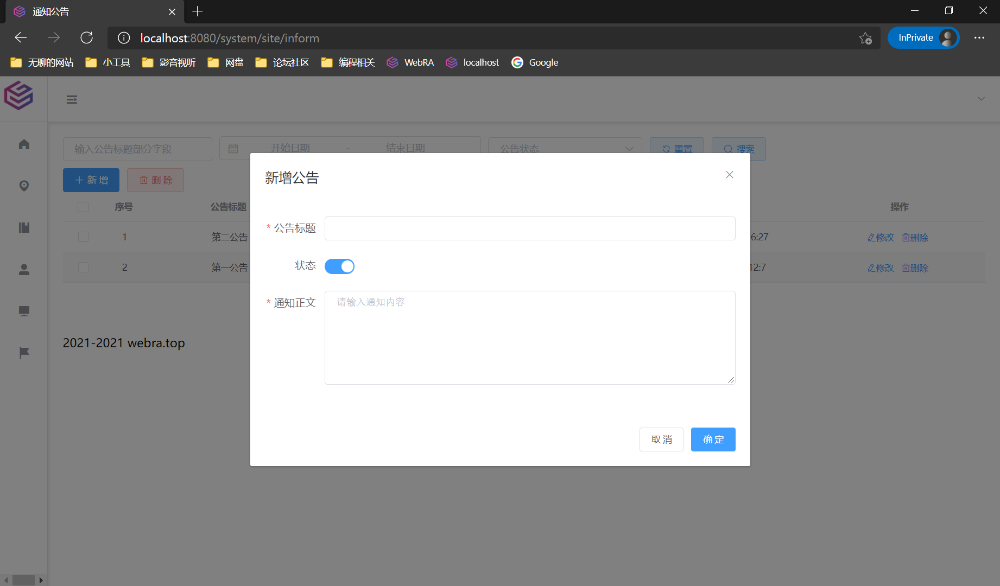
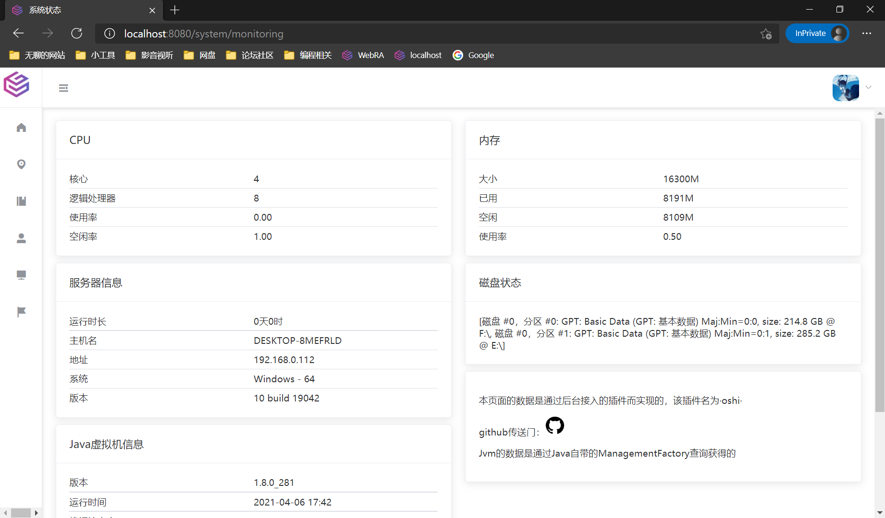
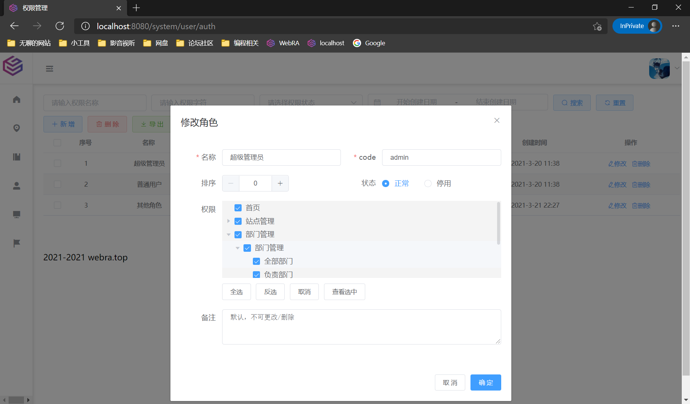

### 项目介绍

本项目是后端

项目名：webraAdminVueA

前端：Vue+ElementUI+其他各类组件、图表

前端地址：https://github.com/wiuid/VueA

后端：SpringBoot+SpringSecurity+JWT+其他各类组件

文档地址：https://www.yuque.com/webra/admina/acnlar

### 功能

- 支持动态生成菜单
- 操作、登录、错误日志记录
- 用户管理
- 部门管理
- 权限（角色）管理
- 服务监控
- 岗位管理
- 公告管理
- 等等

### 部署

- 确保mysql、redis运行正常，java环境正常
- 在jar所在目录将`application.yml`放进去，更改其中的mysql、端口、redis、token相关信息
- 执行以下命令中的任意一个
- - 两者命令就是是否将jar响应的信息存储为日志文件进行保存
```text
java -jar xxx.jar &
Java -jar xxx.jar > access.log &
```
- 执行 `exit` 退出操作系统，不这样的话，jar会结束运行












