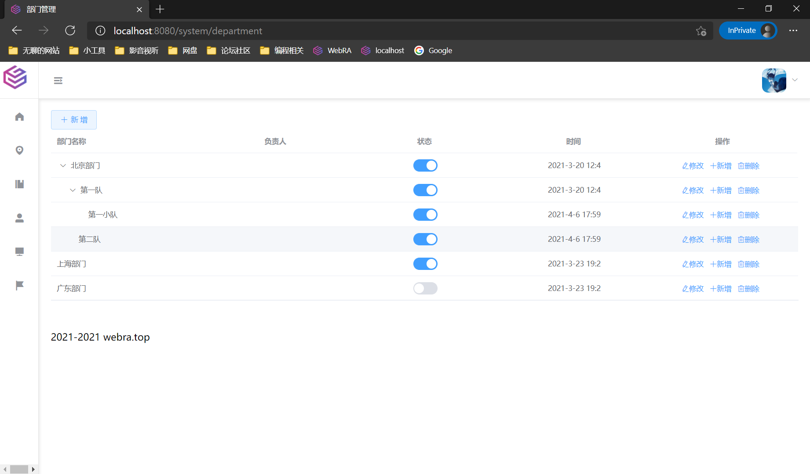

### 项目介绍

本项目是后端

项目名：webraAdminVueA

前端：Vue+ElementUI+其他各类组件、图表

前端地址：https://github.com/wiuid/VueA

后端：SpringBoot+SpringSecurity+JWT+其他各类组件

### 功能

- 支持动态生成菜单
- 操作、登录、错误日志记录
- 用户管理
- 部门管理
- 权限（角色）管理
- 服务监控
- 岗位管理
- 公告管理
- 等等

